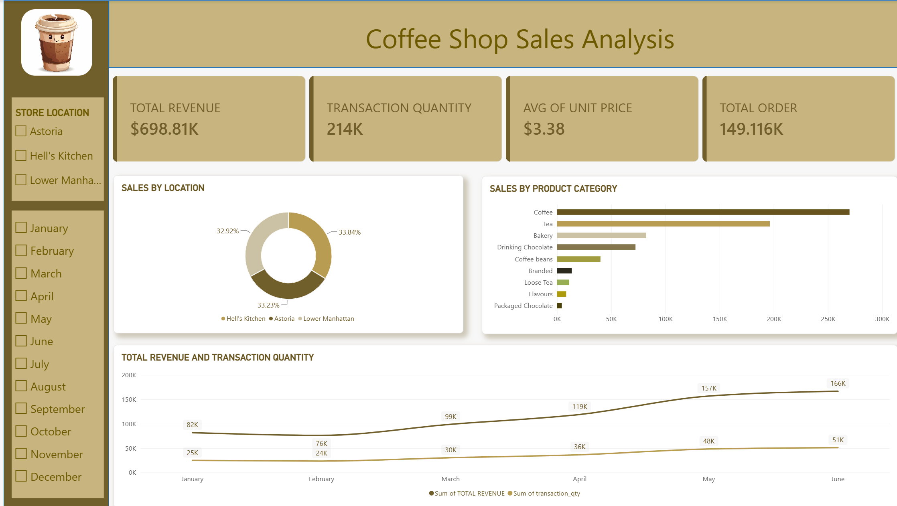

### 📌 Project Overview
This project analyzes the sales performance of a coffee shop chain across three locations. The goal was to build a complete data pipeline from raw data to an interactive dashboard to uncover insights into revenue trends, product performance, and location-based sales.

### 🛠️ Tech Stack Used
*   **Microsoft Excel:** Initial data inspection and formatting.
*   **PostgreSQL:** Data storage, querying, and transformation.
*   **Power BI:** Data visualization and dashboard creation.

### 🔄 The Data Pipeline (Methodology)
1. **Data Ingestion:** Downloaded raw sales data and performed initial review in Excel.
2. **Database Management:** Created tables and imported the dataset into a PostgreSQL relational database.
3. **Data Processing:** Wrote SQL queries to clean the data and verify metrics (e.g., calculating total revenue, filtering out anomalies). 
4. **Data Visualization:** Connected Power BI directly to the PostgreSQL database to model the data and build an interactive dashboard.

### 📊 Key Insights
*   **Total Revenue:** Generated $698K across 149K total transactions.
*   **Top Categories:** Coffee and Tea drive the vast majority of sales.
*   **Location Consistency:** Sales are remarkably evenly distributed across Astoria, Hell's Kitchen, and Lower Manhattan (approx. 33% each).

### 🖼️ Final Dashboard
# Coffee-Shop-Sales-Analysis
